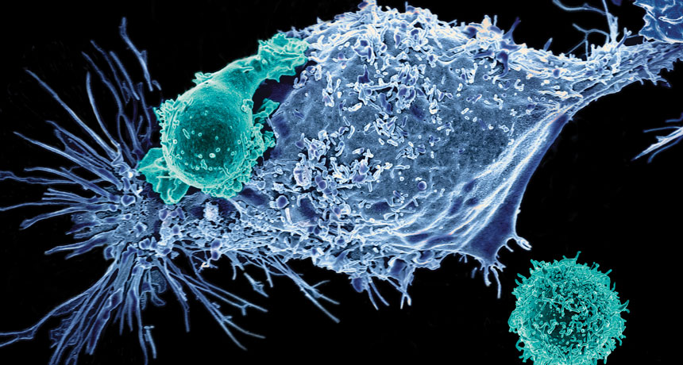

 
  

<h1 align="left"> Literature Review on Breast Cancer Detection, Segmentation and Classification </h2>

<!-- TABLE OF CONTENTS -->
<h2 id="table-of-contents"> :book: Table of Contents</h2>

  
Table of Contents

  <ol>
    <li><a href="#about-the-project"> ➤ Published in 2020</a></li>
      <ul>
        <li><a href="#1"> Deep Learning based Computer Aided Diagnosis System for Breast Mammograms </a></li>
        <li><a href="#2"> A new nested ensemble technique for automated diagnosis of breast cancer </a></li>
        <li><a href="#topological-feature">Topological feature</a></li>
      </ul>
    <li><a href="#about-the-project"> ➤ Published in 2019</a></li>
      <ul>
        <li><a href="#preprocessed-data">Pre-processed data</a></li>
        <li><a href="#statistical-feature">Statistical feature</a></li>
        <li><a href="#topological-feature">Topological feature</a></li>
      </ul>
    <li><a href="#about-the-project"> ➤ Published in 2018</a></li>
      <ul>
        <li><a href="#preprocessed-data">Pre-processed data</a></li>
        <li><a href="#statistical-feature">Statistical feature</a></li>
        <li><a href="#topological-feature">Topological feature</a></li>
      </ul>   
	<li><a href="#about-the-project"> ➤ Published in 2017</a></li>
      <ul>
        <li><a href="#preprocessed-data">Pre-processed data</a></li>
        <li><a href="#statistical-feature">Statistical feature</a></li>
        <li><a href="#topological-feature">Topological feature</a></li>
      </ul>          
  </ol>

<!-- 1 -->
<h4 id="1"> :book: <a href="https://thesai.org/Publications/ViewPaper?Volume=8&Issue=7&Code=ijacsa&SerialNo=38"> Deep Learning based Computer Aided Diagnosis System for Breast Mammograms </a></h4>
<table style="width: 100%;border-collapse:collapse;" border = "2" cellpadding = "5">
  	<thead>
		<tr>
			<th> Dataset </th>
			<th> Image Type </trh>
			<th> Problem </th>
			<th> Evaluation Method </th>
			<th> Performance </th>
			<th> Future Work </th>
		</tr>
	<thead>
	<tbody>
		<tr>
			<td> MIAS and DDMS </td>
			<td> Mammography </td>
			<td> Supervised Learning </td>
			<td> 10-fold cross validation </td>
			<td> Accuracy: 93.35% Sensitivity: 93% </td>
            <td> Mammography </td>
		</tr>
	</tbody>
</table>

<h5 id="about-the-project"> :pencil: Abstract</h5>

 
In this paper, a framework has been presented by using a combination of deep Convolutional Neural Network (CNN) with Support Vector Machine (SVM). Proposed method first perform preprocessing to resize the image so that it can be suitable for CNN and perform enhancement quality of the images can be enhanced. Deep Convolutional Neural Network (CNN) has been used for features extraction and classification with Support Vector Machine (SVM). Standard dataset MIAS and DDMS has been employed for testing the proposed framework by generating new images from these datasets by the process of augmentation. Different performance measures like Accuracy, Sensitivity, Specificity and area under the curve (AUC) has been employed as a quantitative measure and compared with state of the art existing methods. Results shows that proposed framework has attained accuracy 93.35% and 93% sensitivity.

✤ <strong> DOI: </strong> <a href="https://thesai.org/Publications/ViewPaper?Volume=8&Issue=7&Code=ijacsa&SerialNo=38"> 10.14569/IJACSA.2017.080738 </a>

  :house: <a href="#table-of-contents">  Back to Table of Contents</a> 

<!-- 2 -->
<h4 id="2"> :book: <a href="https://thesai.org/Publications/ViewPaper?Volume=8&Issue=7&Code=ijacsa&SerialNo=38"> A new nested ensemble technique for automated diagnosis of breast cancer </a></h4>
<table style="width: 100%;border-collapse:collapse;" border = "2" cellpadding = "5">
  	<thead>
		<tr>
			<th> Dataset </th>
			<th> Image Type </trh>
			<th> Problem </th>
			<th> Evaluation Method </th>
			<th> Performance </th>
			<th> Future Work </th>
		</tr>
	<thead>
	<tbody>
		<tr>
			<td> Breast Cancer Wisconsin Diagnostic (WDBC) </td>
			<td> Digitized image of Fine Needle Aspirate (FNA) </td>
			<td> Supervised Learning </td>
			<td> stratified k-fold cross validation (k=3, 5, 10) </td>
			<td> Accuracy: 93.35% Sensitivity: 93% </td>
            <td> Mammography </td>
		</tr>
	</tbody>
</table>
<h5 id="about-the-project"> :pencil: Abstract</h5> 
 Nowadays, breast cancer is reported as one of most common cancers amongst women. Early detection of this cancer is an essential to aid in informing subsequent treatments. This study investigates automated breast cancer prediction using machine learning and data mining techniques. We proposed the nested ensemble approach which used the Stacking and Vote (Voting) as the classifiers combination techniques in our ensemble methods for detecting the benign breast tumors from malignant cancers. Each nested ensemble classifier contains “Classifiers” and “MetaClassifiers”. MetaClassifiers can have more than two different classification algorithms. In this research, we developed the two-layer nested ensemble classifiers. In our two-layer nested ensemble classifiers the MetaClassifiers have two or three different classification algorithms. We conducted the experiments on Wisconsin Diagnostic Breast Cancer (WDBC) dataset and K-fold Cross Validation technique are used for the model evaluation. We compared the proposed two-layer nested ensemble classifiers with single classifiers (i.e., BayesNet and Naive Bayes ) in terms of the classification accuracy, precision, recall, F1 measure, ROC and computational times of training single and nested ensemble classifiers. We also compared our best model with previous works reported in the literatures in terms of accuracy. The results demonstrate that the proposed two-layer nested ensemble models outperformance the single classifiers and most of the previous works. Both SV-BayesNet-3-MetaClassifier and SV-Na¨ıve Bayes-3-MetaClassifier achieved accuracy 98.07% (K = 10). However, SV-Na¨ıve Bayes-3-MetaClassifier is more efficiency as it needs less time to build the model.

✤ <strong> DOI: </strong> <a href="https://www.sciencedirect.com/science/article/abs/pii/S0167865518308766?via%3Dihub"> 10.1016/j.patrec.2018.11.004 </a>

  :house: <a href="#table-of-contents">  Back to Table of Contents</a> 

<!-- CREDITS -->
<h2 id="credits"> :scroll: Credits</h2>

Mohammad Amin Shamshiri

